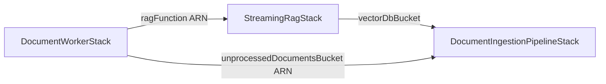

# Plan: Centralized frontend-access IAM role in `DocumentWorkerStack`

## Context

The frontend needs scoped AWS credentials to drive the RAG system end-to-end:
upload/delete unprocessed PDFs, consume `DocumentProcessed` notifications off the
SQS worker queue (parking delivery failures on a DLQ), and invoke the streaming
RAG query Lambda. Today **no IAM identity exists for the frontend**.

The goal is a single least-privilege `iam.Role` in `DocumentWorkerStack` whose
policy statements reference **live construct ARNs via CDK cross-stack exports**,
never hardcoded names.

### The blocker and the fix

The role belongs in `DocumentWorkerStack`, but two of its target resources live
elsewhere: the upload bucket in `DocumentIngestionPipelineStack`, the RAG Lambda
in `StreamingRagStack`. Today the dependency edge runs **the wrong way**: Pipeline
owns the `DocumentProcessedRule` that targets Worker's queue, so Pipeline depends
on Worker (`bin/app.ts:34`). If Worker then imported the bucket/Lambda ARNs, CDK
would have a cycle.

**Fix:** relocate the `DocumentProcessed` routing (rule + delivery DLQ + the
queue grant) from Pipeline into Worker. Pipeline stops referencing Worker
entirely — it only emits to the default bus. Worker now owns both its queue *and*
the rule that feeds it (a cleaner pub/sub boundary), and can safely import the
bucket and Lambda ARNs for the role. Verified current state: `document-worker-stack.ts`
is queue+DLQ only (38 lines); the routing lives at `document-ingestion-pipeline-stack.ts:191-242`.

## Resulting dependency graph (acyclic)



Before: `Pipeline → Worker` (back-edge). After: nothing points into Worker, so
`cdk synth --all` stays acyclic. Instantiation order in `bin/app.ts` becomes
Pipeline → StreamingRag → **Worker last**.

## Changes

### A. Share the event-source string — `config/index.ts`

`eventSourceFor` is currently a static method on `DocumentIngestionPipelineStack`
(`document-ingestion-pipeline-stack.ts:23-25`). Both the Pipeline Lambda env var
and Worker's new rule must use the identical source string, and Worker shouldn't
import the Pipeline class just for it. Move it to a shared pure function:

```ts
// packages/cdk/config/index.ts
export function eventSourceFor(environmentName: string): string {
  return `DocumentVectorizationPipeline.${environmentName}`;
}
```

(This matches the original design intent — `docs/design-docs/2026-06-10-parameterize-cdk-environments.md:204`
already lists `eventSourceFor` as belonging in `config/index.ts`.) Update the
Pipeline Lambda env (`document-ingestion-pipeline-stack.ts:142`) to call the
imported function and delete the static method.

### B. Strip `DocumentProcessed` routing out of `document-ingestion-pipeline-stack.ts`

Remove lines **191-242**: `documentProcessedDeliveryDlq`, the
`sqs.Queue.fromQueueArn(... "DocumentProcessedQueueRef" ...)` import, the
`documentProcessedRule`, and the `DocumentProcessedQueuePolicy`.

Remove `documentProcessedQueue` from `DocumentIngestionPipelineStackProps`
(lines 12-20, keep `deploymentEnvironmentName`).

After this the `import * as sqs from "aws-cdk-lib/aws-sqs"` (line 7) is **unused —
delete it** or lint fails. `events`, `events_targets` (still used by
`S3ObjectAddedRule`), `iam`, `lambda`, `s3` all stay.

**Keep everything else**: both buckets, vectorization Lambda + its `eventSource`
env var, `events:PutEvents` grant, `this.eventBus`, and `S3ObjectAddedRule`.

### C. Add routing + role to `document-worker-stack.ts`

Add imports: `aws-iam`, `aws-s3`, `aws-lambda`, `aws-events`,
`aws-events-targets`, and `eventSourceFor` from `../config`.

Extend props and fields:

```ts
export interface DocumentWorkerStackProps extends cdk.StackProps {
  deploymentEnvironmentName: string;
  unprocessedDocumentsBucket: s3.IBucket;   // from Pipeline
  ragFunction: lambda.IFunction;            // from StreamingRag
}
// class field: public readonly frontendAccessRole: iam.Role;
```

After the queue is created (current line 31), add the relocated routing. Because
rule and queue are now in the **same** stack, the `SqsQueue` target auto-adds the
EventBridge→queue `SendMessage` policy in-stack and also grants the delivery DLQ —
so the old explicit `QueuePolicy` and `fromQueueArn` import are unnecessary:

```ts
const env = props.deploymentEnvironmentName;
const deliveryDlq = new sqs.Queue(this, "DocumentProcessedDeliveryDlq", {
  queueName: `document-processed-delivery-dlq-${env}-${this.region}`,
  retentionPeriod: cdk.Duration.days(14),
});
const defaultBus = events.EventBus.fromEventBusName(this, "DefaultEventBus", "default");
new events.Rule(this, "DocumentProcessedRule", {
  eventBus: defaultBus,
  eventPattern: {
    source: [eventSourceFor(env)],
    detailType: ["DocumentProcessed"],
  },
  targets: [new events_targets.SqsQueue(this.queue, { deadLetterQueue: deliveryDlq })],
});
```

Then the centralized role. The role is the `IGrantable`; use **CDK `grant*()`
helpers** on the live constructs rather than hand-written `PolicyStatement`s — each
helper attaches an identity-based statement to the role and resolves the resource
ARN via cross-stack export automatically. Trust = same-account principal:

```ts
this.frontendAccessRole = new iam.Role(this, "FrontendAccessRole", {
  roleName: `frontend-access-${env}-${this.region}`,
  assumedBy: new iam.AccountPrincipal(this.account),
  description: "Scoped access for the frontend to drive the RAG system",
});

// S3: upload/delete unprocessed documents (object-level).
props.unprocessedDocumentsBucket.grantPut(this.frontendAccessRole);
props.unprocessedDocumentsBucket.grantDelete(this.frontendAccessRole);
// SQS: consume DocumentProcessed notifications off the worker queue
// (ReceiveMessage + DeleteMessage + ChangeMessageVisibility + GetQueue*).
this.queue.grantConsumeMessages(this.frontendAccessRole);
// SQS: park failures on the consumer DLQ (deadLetterQueue from line 23).
deadLetterQueue.grantSendMessages(this.frontendAccessRole);
// Lambda: invoke the RAG query function (direct + Function URL).
props.ragFunction.grantInvoke(this.frontendAccessRole);
props.ragFunction.grantInvokeUrl(this.frontendAccessRole);

new cdk.CfnOutput(this, "FrontendAccessRoleArn", {
  description: "IAM role the frontend assumes to access the RAG system",
  value: this.frontendAccessRole.roleArn,
});
```

Helper → action mapping (all identity-based, so no resource-policy edits and no
new cross-stack back-edges):
- `grantPut` → `s3:PutObject`, `s3:PutObjectLegalHold/Retention/Tag, Abort*` on
  `arnForObjects("*")`; `grantDelete` → `s3:DeleteObject*`.
- `grantConsumeMessages` → `sqs:ReceiveMessage`, `sqs:ChangeMessageVisibility`,
  `sqs:GetQueueUrl`, `sqs:DeleteMessage`, `sqs:GetQueueAttributes`.
- `grantSendMessages` → `sqs:SendMessage`, `sqs:GetQueueAttributes`,
  `sqs:GetQueueUrl`.
- `grantInvoke` → `lambda:InvokeFunction`; `grantInvokeUrl` →
  `lambda:InvokeFunctionUrl`.

These cover the requested actions (the grant sets are slightly broader on the
read-metadata side, which is the accepted trade-off for using the idiomatic
helpers). The consumer DLQ reuses the existing `deadLetterQueue` (current line 23),
**not** the new delivery DLQ. Update the class doc-comment (lines 9-14), which
currently says the feeding rule "lives in `DocumentIngestionPipelineStack`".

### D. Rewire and reorder `bin/app.ts`

Instantiate Pipeline → StreamingRag → Worker; capture the StreamingRag instance
in a variable (today it is discarded). Drop the `documentProcessedQueue` prop and
the stale "Created first so the pipeline stack's rule can target the queue"
comment.

```ts
const pipelineStack = new DocumentIngestionPipelineStack(app, `DocumentIngestionPipelineStack-${cfg.deploymentEnvironmentName}`, {
  env, deploymentEnvironmentName: cfg.deploymentEnvironmentName,
  description: "Stack for document ingestion pipeline",
});
const streamingRagStack = new StreamingRagStack(app, `StreamingRagStack-${cfg.deploymentEnvironmentName}`, {
  env, deploymentEnvironmentName: cfg.deploymentEnvironmentName,
  description: "Streaming serverless RAG demo using Lambda, LanceDB on S3, and Amazon Bedrock",
  vectorDbBucket: pipelineStack.vectorDbBucket,
});
new DocumentWorkerStack(app, `DocumentWorkerStack-${cfg.deploymentEnvironmentName}`, {
  env, deploymentEnvironmentName: cfg.deploymentEnvironmentName,
  description: "SQS queue + DLQ for downstream DocumentProcessed consumers, plus the frontend-access role",
  unprocessedDocumentsBucket: pipelineStack.unprocessedDocumentsBucket,
  ragFunction: streamingRagStack.lambdaFunction,
});
```

`pipelineStack.unprocessedDocumentsBucket` (`s3.Bucket`) and
`streamingRagStack.lambdaFunction` (`lambda.Function`) satisfy the `IBucket` /
`IFunction` prop types.

## Files touched

| File | Change |
| ---- | ------ |
| `packages/cdk/config/index.ts` | add `eventSourceFor` |
| `packages/cdk/lib/document-ingestion-pipeline-stack.ts` | remove routing (191-242), drop `documentProcessedQueue` prop + unused `sqs` import, call shared `eventSourceFor`, delete static method |
| `packages/cdk/lib/document-worker-stack.ts` | new imports, extended props, relocated routing, `FrontendAccessRole` + output |
| `packages/cdk/bin/app.ts` | reorder stacks, capture RAG stack, new Worker props, drop old prop/comment |

No CDK unit tests exist, so none need updating.

## Migration caveat

The rule, delivery DLQ, and queue policy move stacks → CloudFormation deletes them
from Pipeline and recreates them in Worker. The delivery DLQ is an error-path queue
(normally empty), so no data loss. Deploy with `cdk deploy --all` so ordering is
handled.

## Verification

From `packages/cdk` (per CLAUDE.md "Verifying Before You Commit"):

1. `yarn build` — TypeScript compiles.
2. `yarn cdk synth --all` — succeeds with **no dependency cycle**.
3. Inspect synthesized templates:
   - `DocumentWorkerStack-*`: `FrontendAccessRole` with the grant-generated
     statements (S3 put/delete on the bucket, SQS consume on the queue, SQS send
     on the consumer DLQ, Lambda invoke + invoke-url; bucket + RAG-function ARNs
     resolved via `Fn::ImportValue`), the relocated `DocumentProcessedRule` +
     delivery DLQ + auto-generated queue policy, and the `FrontendAccessRoleArn`
     output.
   - `DocumentIngestionPipelineStack-*`: no `DocumentProcessedRule`, delivery DLQ,
     or queue policy; still has `S3ObjectAddedRule` and the `eventSource` env var
     equal to `DocumentVectorizationPipeline.<env>`.
4. Confirm the source string matches the contract in
   `docs/Eventbridge event schema.md` (`DocumentVectorizationPipeline.dev`) so the
   rule still matches emitted events.
5. (Optional, post-deploy) assume the role; confirm a `PutObject` to the upload
   bucket and an invoke of the RAG Function URL succeed; confirm a `DocumentProcessed`
   `PutEvents` still lands on the worker queue.
